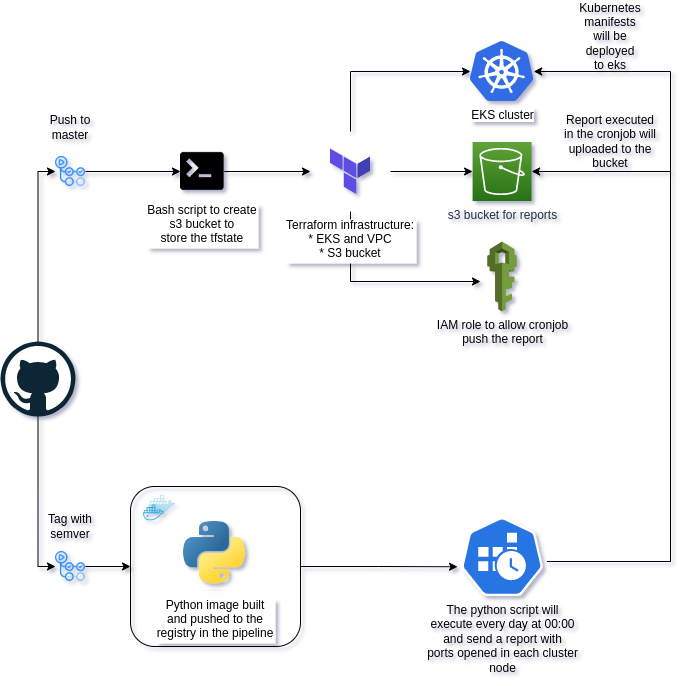

# Node report assessment

## Description

Periodic report of all the Kubernetes nodes opened ports, with an easy-to-parse output, similar to:

Node1: [22,80,443]
Node2: [22,443]
Master1: [22,443]

## Solution



The report should be generated daily and stored in a S3 bucket. I assume that I will need two apps, one to generate the report and another to fetch it.

- To generate the report I have decided to use python and a cronjob in kubernetes to run it every day at 00:00. The report will be stored in a S3 bucket. The python script will check the opened ports in all the nodes and will generate a report, it will parse a whitelist of ports to ignore selected by the user and will push the report to the S3 bucket. Apart from that, the python script will send an email to the user if the script fails.

- To fetch the report I have decided to use a golang app to download the report from the S3 bucket.

## Requirements

If you want to run the code locally you will need:

- Set the environment variables AWS_DEFAULT_REGION, AWS_ACCESS_KEY_ID and AWS_SECRET_ACCESS_KEY, MAIL_PASSWORD, MAIL_USER, FILENAME, BUCKET_NAME
- AWS credentials configured
- awscli
- Terraform
- Python
- Golang
- Kubectl
- Replace this function in the python code config.load_incluster_config() by config.load_kube_config() to run it locally

## Infrastructure

The infrastructure is composed by a Kubernetes cluster in AWS with 2 managed node groups and an S3 bucket to push/pull the daily report. All will be created by Terraform and automated by github actions when push to master branch but you can also run it manually with the following steps:

- To check all Makefile commands you can run:

```bash
make help
```

- Create a S3 bucket to store the Terraform state

```bash
make s3-creation
```

- Check the Terraform plan

```bash
make tf-plan
```

- Deploy the eks cluster and the node groups

```bash
make tf-deploy
```

- Get the kubeconfig file

```bash
make kubeconfig
```

## Application

In app_report folder there are 4 files:

- Dockerfile: to build the docker image
- check_ports.py: the python script to check the opened ports
- requirements.txt: the python dependencies
- whitelist.txt: the whitelist of ports to ignore

The script will check the opened ports in all the nodes and will generate a report in the following format:

```bash
Node1: [22,80,443]
Node2: [22,443]
Master1: [22,443]
```

In kubernetes folder there are 4 files:

- cronjob.yaml: the cronjob to run the script every day at 00:00. You could populate the name of the specific bucket in env variables inside the cronjob
- rbac.yaml: the role and rolebinding to allow the cronjob to have permissions to run the script for getting node information
- serviceaccount.yaml: the service account for the cronjob with the aws role attached
- kustomization.yaml: the kustomization file to deploy all the previous files

The cronjob will run the script and will push the report to the S3 bucket called "s3-report-bucket-diego"

## Fetch report

To fetch the report you can run the following command:

```bash
make fetch-report
```

It will download the report with the current day from the S3 bucket and leave it in report_puller/bin folder

## Pipelines

### Github actions

The pipelines are configured in .github/workflows folder:

- infra.yaml: to deploy the terraform infrastructure from every push to master branch
- app-build.yaml: to build and to deploy the application from a tag in semver format

### Secrets

The secrets should be configured in github repository settings with the following names:

- AWS_ACCESS_KEY_ID
- AWS_DEFAULT_REGION
- AWS_SECRET_ACCESS_KEY
- DOCKER_PASSWORD
- DOCKER_USERNAME
- MAIL_PASSWORD
- MAIL_SENDER
- PAT_TAG

## Monitoring

For monitoring my approach would be to create an endpoint inside the python script using the Prometheus python library developing the metric to expose it on port 9099, this would mean that it would be necessary to expose the port and the cronjob with a service inside the kubernetes cluster so Prometheus can do the scrape. To visualize the metrics I would use Grafana and I would create a dashboard but first I would check in Prometheus if the metric is being scraped correctly.

## Improvements

- Add gitops paradigm to deploy the manifests and update the image tags
- Add a helm chart to deploy the application
- Build a lightweight docker image
- Add a e2e test in the pipeline raising a kind cluster and running the script
